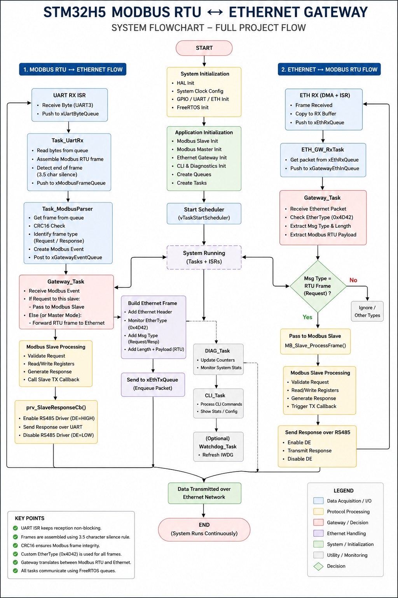

````markdown
# STM32H5 Industrial Ethernet Gateway

RTOS-based industrial communication gateway firmware for **Modbus RTU ↔ Ethernet translation** using **STM32H5**, **FreeRTOS**, UART/RS485 communication, and custom Ethernet frame encapsulation.

The project implements a modular embedded communication architecture capable of:
- Modbus RTU Master/Slave communication
- UART interrupt-driven frame handling
- Ethernet frame encapsulation and forwarding
- RMII Ethernet communication
- Queue-based RTOS task synchronization
- Real-time protocol translation
- Wireshark packet analysis

---

# System Architecture



---

# Communication Flow

```text
Modbus RTU Slave
        ↓ RS485/UART
STM32H5 Gateway Firmware
        ↓
UART RX ISR
        ↓
Byte Queue
        ↓
Frame Assembly Task
        ↓
Modbus Parser Task
        ↓
Gateway Translation Layer
        ↓
Ethernet TX Queue
        ↓
Ethernet TX Task
        ↓ RMII Ethernet
PC / Wireshark
````

---

# Hardware Platform

| Component     | Description   |
| ------------- | ------------- |
| MCU           | STM32H573I-DK |
| RTOS          | FreeRTOS      |
| Communication | UART / RS485  |
| Networking    | Ethernet RMII |
| IDE           | STM32CubeIDE  |

---

# Hardware Setup


---

# Key Features

## Communication

* Modbus RTU Master
* Modbus RTU Slave
* RS485 half-duplex control
* UART interrupt-driven reception
* Ethernet frame TX/RX
* Custom EtherType protocol

---

## RTOS Architecture

* Queue-based IPC
* ISR-safe communication
* Event-driven firmware design
* Modular task separation
* Dedicated Ethernet TX/RX tasks

---

## Networking

* Raw Ethernet frame generation
* Custom Layer-2 encapsulation
* DMA-based Ethernet communication
* RMII MAC/PHY communication
* Wireshark protocol analysis

---

# RTOS Task Architecture

| Task                | Purpose                       |
| ------------------- | ----------------------------- |
| `Task_UartRx`       | UART frame assembly           |
| `Task_ModbusParser` | CRC validation + parsing      |
| `Gateway_Task`      | Modbus ↔ Ethernet translation |
| `ETH_GW_RxTask`     | Ethernet RX handling          |
| `ETH_GW_TxTask`     | Ethernet TX handling          |
| `DIAG_Task`         | Runtime diagnostics           |
| `CLI_Task`          | UART command interface        |

---

# Queue Architecture

| Queue                | Purpose                 |
| -------------------- | ----------------------- |
| `xUartByteQueue`     | UART ISR → UART RX Task |
| `xModbusFrameQueue`  | UART RX → Parser        |
| `xGatewayEventQueue` | Parser → Gateway        |
| `xEthRxQueue`        | Ethernet RX → Gateway   |
| `xEthTxQueue`        | Gateway → Ethernet TX   |

---

# UART Interrupt Architecture

UART reception is fully interrupt-driven.

The ISR performs ONLY:

* byte reception
* queue posting
* interrupt rearming

Heavy processing such as:

* CRC validation
* Modbus parsing
* Ethernet packet generation

is intentionally moved into RTOS tasks to minimize interrupt latency.

---

# Modbus RTU Processing

The firmware implements:

* timeout-based frame assembly
* CRC16 validation
* request/response parsing
* broadcast handling
* master/slave support

Frame boundaries are detected using:

```text
3.5 character silence timeout
```

---

# RS485 Direction Control

Half-duplex RS485 communication is implemented using GPIO-controlled transmit direction switching.

```text
Enable TX Driver
    ↓
Transmit UART Frame
    ↓
Wait for Completion
    ↓
Disable TX Driver
```

---

# Ethernet Encapsulation Protocol

The project implements a custom Layer-2 Ethernet transport protocol.

## Ethernet Frame Format

```text
| DST MAC | SRC MAC | EtherType | Msg Type | Length | RTU Payload |
```

## Custom EtherType

```text
0x4D42
```

---

# Example Modbus RTU Response

## RTU Payload

```text
01 03 04 00 64 00 32 BA 1E
```

Meaning:

* Slave ID = 1
* Function = Read Holding Registers
* Register1 = 100
* Register2 = 50

---

# Example Ethernet Encapsulation

```text
FF FF FF FF FF FF
02 11 22 33 44 55
4D 42
00 02
00 09
01 03 04 00 64 00 32 BA 1E
```

---

# Ethernet Communication Pipeline

```text
Modbus Slave
      ↓
UART RX ISR
      ↓
Frame Parser
      ↓
Gateway Translation
      ↓
ETH TX Queue
      ↓
HAL_ETH_Transmit()
      ↓
STM32 Ethernet MAC
      ↓
RMII PHY
      ↓
Ethernet Network
```

---

# Wireshark Packet Analysis

Generated Ethernet packets can be analyzed using Wireshark.

## Wireshark Filter

```text
eth.type == 0x4D42
```

---

# Wireshark Analysis


The capture validates:

* Ethernet frame transmission
* custom EtherType packets
* Modbus RTU encapsulation
* STM32H5 Ethernet communication

---

# Embedded Concepts Demonstrated

* FreeRTOS task scheduling
* ISR-safe communication
* Queue-based IPC
* UART interrupt handling
* Ethernet MAC communication
* RMII Ethernet
* Modbus RTU protocol handling
* DMA-based Ethernet communication
* Protocol encapsulation
* Industrial gateway architecture

---

# Folder Structure

```text
stm32h5-industrial-ethernet-gateway/
│
├── README.md
├── LICENSE
├── .gitignore
│
├── Images/
├── Docs/
├── Firmware/
└── Tools/
```

---

# Future Improvements

* Modbus TCP support
* lwIP integration
* TCP/UDP transport
* DMA-based UART TX
* Python Ethernet packet tool
* Custom Wireshark dissector
* Web diagnostics dashboard
* Multi-node gateway routing

---

# Images To Add

Place these inside:

```text
Images/
```

| File Name                | Description                     |
| ------------------------ | ------------------------------- |
| `SystemArchitecture.png` | Main architecture block diagram |
| `HardwareSetup.jpg`      | Real STM32H5 hardware image     |
| `WiresharkAnalysis.png`  | Wireshark packet capture        |
| `RTOSFlow.png`           | RTOS task flow diagram          |
| `QueueArchitecture.png`  | Queue communication diagram     |

---

# Engineering Focus

This project focuses on:

* Industrial communication systems
* Embedded networking
* RTOS firmware architecture
* Ethernet gateway design
* Protocol translation
* Queue-based communication pipelines

---

# License

This project is intended for educational, research, and embedded firmware portfolio purposes.

```
```
